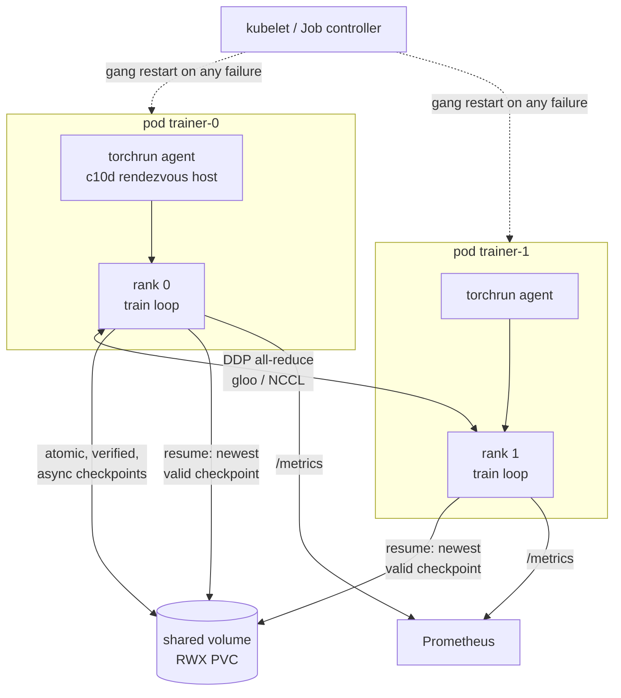

# Resilient Trainer

[](https://github.com/Nags-gk/resilient-trainer/actions/workflows/ci.yaml)

**Fault-tolerant distributed PyTorch training that survives crashed workers,
hung collectives, preemption and corrupted checkpoints, and resumes
bit-for-bit.**

On a large training job, hardware faults are routine: a GPU falls off the bus,
a NCCL collective hangs, a spot VM is reclaimed. A job that loses hours of work
on each fault is not viable at scale. This project is a DDP training loop plus
the infrastructure around it: crash-safe checkpointing, coordinated
preemption, hang detection, straggler detection, and a Kubernetes deployment
that recovers from losing a node. It is tested by killing real `torchrun` jobs.

## Results

From [`bench/RESULTS.md`](bench/RESULTS.md) (`python scripts/chaos_bench.py`):
2-rank DDP on CPU (gloo) under `torchrun`, 600 steps, checkpoint every 50.

| What was injected | Outcome |
|---|---|
| SIGKILL a worker at a random step (5 trials, both ranks) | Restarted and resumed in **2.18 s median** (max 2.6 s); lost work ≤ one checkpoint interval; **5/5 runs reproduced the uninterrupted run's losses and eval loss bit-for-bit** |
| A rank hangs inside the step | Watchdog aborts after `--hang-timeout` (not the backend's 30-minute default), dumps stacks, job resumes |
| SIGTERM (spot reclaim / pod eviction) | All ranks agree to stop at the same step, checkpoint it, exit 0; the next run resumes from **that exact step: zero lost work** |
| Newest checkpoint corrupted on disk | SHA-256 check fails, falls back to the previous checkpoint automatically |
| One rank 80 ms slower per step | Flagged as a straggler within one detection window |
| A whole node lost (agent + worker SIGKILLed) | Gang restart, resumed from the last checkpoint in ~6 s (`scripts/multinode_rehearsal.py`) |
| A training pod deleted on Kubernetes | Job recreates it, the gang re-rendezvouses, training resumes and completes (`hack/e2e.sh` on kind, in CI) |
| Checkpoint stall, 38 MB checkpoint | Async save blocks the loop **7.4 ms vs 104.8 ms** synchronous (**−93%**) |

## How it works



- **Deterministic data.** Every batch is a pure function of `(seed, step, rank)`. With the model, optimizer and RNG state checkpointed, a resumed run takes exactly the path of an uninterrupted one. That makes "it recovered correctly" testable as equality instead of eyeballing loss curves.
- **Crash-safe checkpoints** (`rtrain/checkpoint.py`): write to a temp file, `fsync`, `os.replace`, then fsync the directory. A SHA-256 manifest is written alongside. Resume walks newest→oldest and skips anything that fails verification or loading. Only the newest `keep_last` are kept.
- **Async checkpoints.** The loop pays only for snapshotting tensors to host memory; serialization and disk I/O run on a background thread. At most one save is in flight, and a background failure is raised on the next save.
- **Agreement on resume.** Rank 0 picks the checkpoint and broadcasts the choice, so ranks never load different steps from a lagging shared filesystem.
- **Coordinated preemption** (`rtrain/resilience.py`): SIGTERM sets a flag, and ranks all-reduce it every step. Everyone stops at the same boundary, checkpoints and exits. Without the all-reduce, one rank would exit while the others hang in the next collective.
- **Hang watchdog.** No progress for `hang_timeout` → dump all thread stacks → `os._exit(86)` → restart and resume.
- **Straggler detection.** Every N steps, ranks all-gather their *pre-collective* compute time and flag any rank above `threshold` × the lower median.
- **Observability.** Prometheus metrics per rank (step time, throughput, loss, checkpoint stall and save time, last checkpoint step, restarts, stragglers), plus a JSON-lines event log of attempts, checkpoints, stops and stragglers.

## Engineering notes

- **Straggler detection must not use wall-clock step time.** Synchronous DDP makes fast ranks wait for the slow one inside the gradient all-reduce, so every rank reports the same step time. The first test injected an 80 ms delay on one rank and detection saw nothing. The detector now uses the time to reach the collective. A second bug surfaced right after: with 2 ranks, the upper median *is* the slow rank, so nothing can exceed it. The lower median fixes that, and a unit test pins it.
- **Multi-node recovery uses a gang restart, not torchrun's per-node restarts.** In a rehearsal where one node lost its agent and worker, the survivor restarted its workers under store prefix `/worker/attempt_1` while the replacement node started at `attempt_0`. They never met, and init timed out. Running torchrun with `--max-restarts=0` and letting Kubernetes restart every container keeps all agents on the same attempt (the JobSet / PyTorchJob approach). Single-node jobs still use torchrun restarts, which is what the chaos benchmark measures.
- **Kill the process tree, not the process group.** torchrun starts workers in their own session, so killing an agent's process group leaves its worker running. The rehearsal kills agent and workers explicitly, as a pod deletion would.
- **gloo has no `ReduceOp.AVG`.** Averaging is done as SUM ÷ world size, so the same code runs on gloo (CPU) and NCCL (GPU).

## Quick start

```bash
make install          # CPU torch + dev tools
make test             # unit tests + fault-injection tests with real torchrun jobs
torchrun --nproc-per-node=2 --max-restarts=3 -m rtrain.train --steps 600 --out-dir runs/demo

# kill a worker at step 137 and watch it resume
CHAOS_KILL_STEP=137 torchrun --nproc-per-node=2 --max-restarts=3 -m rtrain.train --out-dir runs/chaos
make chaos            # the full benchmark → bench/RESULTS.md
make kind-up e2e      # 2-node Job on kind, delete a pod mid-training
```

On GPUs the same code selects NCCL and `cuda:<LOCAL_RANK>` automatically. Use a
CUDA base image and a ReadWriteMany volume (Azure Files, NFS or a Lustre CSI
driver) for `/ckpt`.

## Testing

| Suite | What it proves |
|---|---|
| `tests/test_units.py` (18) | Checkpoint round trip and pruning (sync and async), corrupted / truncated / manifest-less checkpoints skipped, temp files ignored, async snapshot isolated from in-place updates, background failures surfaced, stall accounting, data determinism, config merging, watchdog, SIGTERM flag, straggler median |
| `tests/test_distributed.py` (6) | Real 2-process `torchrun` jobs: learning happens; SIGKILL → bit-identical resume; hang → watchdog → resume; corrupted newest checkpoint → fallback; SIGTERM → checkpoint at the stop step → exact resume; straggler flagged |
| `scripts/multinode_rehearsal.py` | Two agents with c10d rendezvous; node loss → gang restart → resume → completion |
| `hack/e2e.sh` (kind, CI) | Indexed Job + headless Service + shared volume; delete a pod mid-training; asserts resume from a checkpoint and completion |

See [docs/ARCHITECTURE.md](docs/ARCHITECTURE.md) and [docs/STUDY_GUIDE.md](docs/STUDY_GUIDE.md).

## License

MIT
